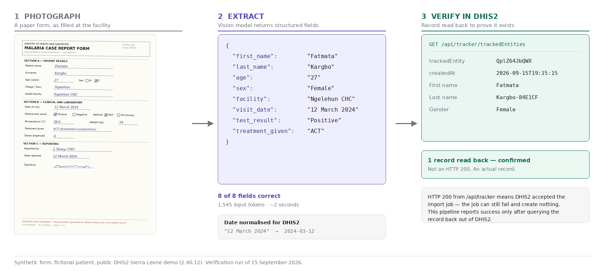

# AI-Assisted Form Capture for DHIS2

**Turn a photographed paper health form into a verified DHIS2 tracker record.**

In most facilities running DHIS2, data begins life on paper. Someone retypes it
days or weeks later. That lag, and that transcription step, are where a great
deal of routine health data quality is lost.

This pipeline removes the retyping. A vision model reads the form, a human
checks the extraction, and the confirmed record goes to DHIS2 through the
tracker API — and is then **read back out of DHIS2** before the pipeline reports
success.



---

## Why this exists

AI-assisted data entry into DHIS2 is not a new idea, and working demonstrations
exist. What is scarce is an implementation you can **read, run, modify and
criticise** — one that documents what breaks as carefully as what works.

This repository is a **reference implementation and research prototype**, for
DHIS2 implementers evaluating the approach, researchers who need a citable
baseline, and teams building something similar who would rather not rediscover
the failure modes.

**It is not a production system.** See [Status](#status).

### How this differs from a commercial product

|  | This repository | A supported product |
|---|---|---|
| Licence | MIT, fully modifiable | Commercial |
| Support | Community issues only | Vendor SLA |
| Purpose | Evaluate, learn, adapt, cite | Deploy and run |
| Transparency | Every design decision documented | Product behaviour |

If you need something to run in a ministry next month, a supported product is
the right choice — SolidLines Tech Services build one, see
[Acknowledgement](#acknowledgement). If you need to understand *how* this works,
adapt it to an unusual programme, or cite it in research, start here.

---

## The feature worth stealing

Most integrations treat `HTTP 200` as success. It is not.

`POST /api/tracker` returns 200 when DHIS2 **accepts the import job**. The job
can still fail validation afterwards and create nothing. Code that prints
"submitted" at that point is lying to whoever photographed the form, and the
health worker has no way to know.

This pipeline follows the import job to completion, then queries the record back
out of DHIS2, filtering on a unique marker it supplied.
`SubmissionResult.confirmed` is true only when a record was actually read back.

```python
extraction, submission = run_pipeline(spec, meta, "form.jpg", config, ...)

submission.confirmed         # True only if the record exists in DHIS2
submission.verified_records  # what DHIS2 returned when asked
```

If you take one thing from this repository, take that.

---

## Status

| | |
|---|---|
| Extraction from photographed forms | Working |
| Submission to the DHIS2 tracker API | Working |
| End-to-end record creation, confirmed by read-back | **Verified** — `QplZ64JbQWX`, 15 Sep 2026 |
| Formal accuracy evaluation | **Not yet done** |
| Production readiness | **No** — see [Safety](#safety) |

### What has actually been measured

Honest and limited. On the synthetic malaria case report in [`examples/`](examples/),
against the public DHIS2 Sierra Leone demo (2.40.12):

- **8 of 8 fields extracted correctly**, including a longhand date
  ("12 March 2024") correctly normalised to `2024-03-12`
- 1,545 input tokens, 115 output tokens, roughly two seconds
- Record created and read back: `trackedEntity QplZ64JbQWX`

That is **n = 1, on a clean synthetic form**. It demonstrates the pipeline works
end to end. It says nothing about accuracy on real handwriting, poor
photographs, or ticked checkboxes — which is where vision models actually fail.

No formal evaluation against manual entry has been performed. Anyone deploying
this should measure it on their own forms first; a benchmark is the first item
on the [roadmap](#roadmap).

---

## Safety

**Do not process real patient data with this as written.**

**Patient data leaves your jurisdiction.** Form images are sent to a vision model
API hosted outside most implementing countries. Under many national health data
protection laws that is not permitted for identifiable patient data, and it is a
cross-border transfer problem wherever GDPR applies. This is a legal question to
settle before it is a technical one. Where transfer is not permissible you need a
self-hosted model or a regionally hosted endpoint, not a workaround.

**Human review is not optional.** Vision models misread handwriting, transpose
digits, and occasionally return a confident value for a field that is blank. A
mandatory confirmation step is built in. Do not remove it.

**Never commit credentials.** Keys are read from environment variables or Colab
Secrets. The demo credentials used here (`admin` / `district`) are publicly
documented by DHIS2 and grant access to nothing private.

---

## Five-minute demo

No installation. The notebook generates its own synthetic form, so there is
nothing to upload.

1. Open [`notebooks/dhis2_form_capture.ipynb`](notebooks/dhis2_form_capture.ipynb) in Google Colab
2. Click the **key icon** in Colab's sidebar, then **Add new secret**, named
   exactly `ANTHROPIC_API_KEY`, and switch **Notebook access** ON
3. Run the cells in order

You will see the form generated, the fields extracted, what will and will not be
saved, the record submitted, and finally the record read back out of DHIS2 with
its `trackedEntity` id.

### Running it locally

```bash
pip install -r requirements.txt
export ANTHROPIC_API_KEY=sk-ant-...
python src/verify_setup.py
```

`verify_setup.py` is the pre-flight check for any new server. It tests
connectivity, resolves every configured UID, calls the model, submits a
synthetic record with a unique marker, follows the import job, and reads the
record back. Run it before trusting the pipeline anywhere new.

---

## What's in here

| | |
|---|---|
| [`notebooks/`](notebooks/) | End-to-end Colab demo, documented step by step — **start here** |
| [`src/dhis2_capture.py`](src/dhis2_capture.py) | The library: extraction, validation, submission, read-back verification |
| [`src/verify_setup.py`](src/verify_setup.py) | Pre-flight check against any DHIS2 instance |
| [`tests/`](tests/) | 72 tests, one per observed failure mode — the regression suite for everything in `docs/failure-modes.md` |
| [`docs/failure-modes.md`](docs/failure-modes.md) | What broke during development, why, and how the code prevents it |
| [`docs/DHIS2_METADATA.md`](docs/DHIS2_METADATA.md) | Finding the UIDs on your own instance |
| [`examples/`](examples/) | Synthetic form used by the demo |

```bash
pip install -r requirements-dev.txt
PYTHONPATH=src pytest tests/ -q
```

---

## Adapting it to your own DHIS2

**Discover UIDs; never copy them.** Every UID belongs to one database. Copying an
organisation unit or attribute UID from someone else's notebook is the most
common cause of silent failure, because DHIS2 rejects unknown UIDs with messages
that do not name the offending field.

```python
from dhis2_capture import DHIS2Config, PipelineSpec, discover_program, run_pipeline

config = DHIS2Config.from_env()          # DHIS2_BASE_URL / _USERNAME / _PASSWORD
meta = discover_program(config, program_uid="YOUR_PROGRAM_UID",
                        org_unit_name="Your Facility")
print(meta.describe())                   # every attribute, with mandatory/generated flags

spec = PipelineSpec(
    name="malaria_case_report",
    input_type="photo",
    fields=["first_name", "last_name", "sex", "age", "facility",
            "visit_date", "test_result", "treatment_given"],
    attribute_map={"first_name": meta.find("first name"),
                   "last_name":  meta.find("last name"),
                   "sex":        meta.find("gender", "sex")},
    data_element_map={"test_result": "YOUR_DE_UID"},
    program_stage="YOUR_STAGE_UID",
)

extraction, submission = run_pipeline(
    spec, meta, "form.jpg", config,
    anthropic_client=client,
    verify_field="last_name",            # used to read the record back
)
```

Mapping by attribute **name** rather than hardcoded UID keeps the configuration
working across servers.

**Attributes are not data elements.** Identity fields (name, sex, date of birth)
are tracked entity attributes on the enrollment. Clinical observations (test
result, temperature, treatment) are data elements on a programme stage event.
Putting an observation in an attribute is a modelling error that surfaces at
analysis time, long after it is cheap to fix.

**The demo has no malaria programme.** The Sierra Leone demo database ships Child
Programme and a few others, so the example configuration demonstrates the
mechanism with fields that do not clinically belong there. Most malaria fields
are reported as extracted-but-unsaved. That is correct behaviour; on your own
server you would add the attributes and data elements you need.

---

## Known limitations

- **Checkboxes are the weakest point.** Text fields are easy; a tick beside
  "Positive" rather than "Negative" is where vision models fail. Test them
  specifically on your own forms.
- Photograph quality dominates everything downstream: flat even lighting, whole
  form in frame, no shadow across the page.
- No offline mode; connectivity is required at the point of capture.
- No audit log distinguishing AI extractions from human corrections. Needed
  before any evaluation study.
- Voice transcription handles one language per pipeline.
- Accuracy is unmeasured beyond the single run reported above.

---

## Roadmap

- [ ] Formal accuracy benchmark against manual entry, on real forms
- [ ] Checkbox and tick-box extraction evaluation
- [ ] Audit trail separating AI extraction from human correction
- [ ] Offline capture with deferred submission
- [ ] Local or regionally hosted model support, for jurisdictions where
      cross-border transfer is not permitted
- [ ] Multi-language form testing (French, Portuguese, Swahili)
- [ ] Agent-assisted configuration: propose a field-to-UID mapping for an unseen
      form and server, for a human to review before use

Issues and pull requests welcome, particularly on data protection, offline
operation, and measured accuracy.

---

## Acknowledgement

The approach implemented here was demonstrated publicly by **SolidLines Tech
Services** ([solidlines.io](https://www.solidlines.io)), whose AI Data Entry tool
is featured on the [DHIS2 AI page](https://dhis2.org/ai/) and was presented at
the 2025 DHIS2 Annual Conference. This is an independent open implementation of
that approach, not affiliated with or endorsed by them.

DHIS2 is developed by the HISP Centre at the University of Oslo. This project is
not affiliated with HISP UiO.

## Citation

See [`CITATION.cff`](CITATION.cff), or use GitHub's **Cite this repository**
button.

## Licence

MIT. See [`LICENSE`](LICENSE).
